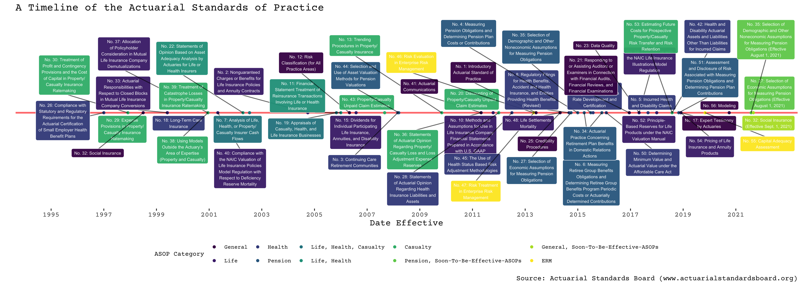
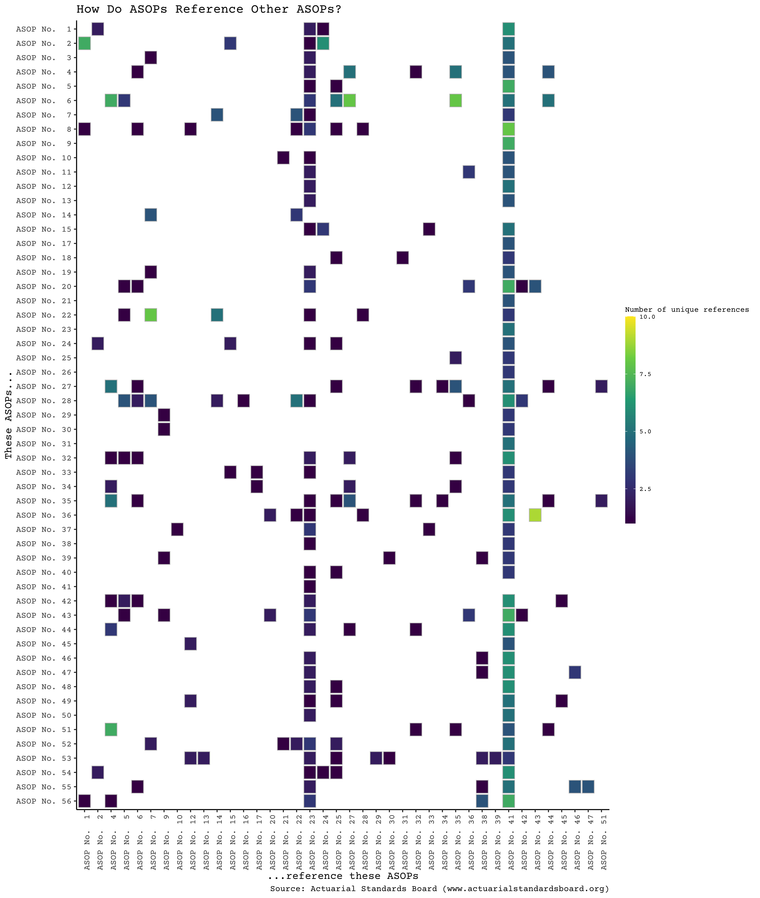

This content was generated using a [R Markdown](http://rmarkdown.rstudio.com) Notebook. The code / .RMD file used to build this page, as well as additional documentation and resources, are all located on [my personal GitHub page](https://github.com/bentwheel/asop-viz).

## What do actuaries do?

I volunteered (with some eagerness) to teach the R training sessions to the bright and talented "virtual" actuarial intern cohorts we have at Cigna this year in our Philadelphia office, and I wanted to kick off the presentation with a showcase of the flexibility and power that the R language and RStudio IDE can bring to a project, all while providing my spin on the so-called million-dollar question: *"What do actuaries do?"*

**tl;dr: I've used a web scraper and a short little bit of R code to web scrape the Actuarial Standards of Practice website and have put together some visualizations of meta-information concerning how the ASOPs are interconnected and a timeline of when the ASOPs in effect today became effective.**

First off, I've only been asking this question for a handful of years myself, so I don't intend for my analysis here to come across with a veneer of deep expertise; nor do I mean to pose this question with a tremendous amount of context, and I certainly don't intend to address the question relative to what other financial professionals do, or what data scientists do, though I admittedly have some strong feelings about those questions, too. And, speaking of feelings, I'm obliged to state that the opinions reflected within this document/post certainly do *not* necessarily reflect the views of my employer. Also, the are not intended to convey or otherwise represent the views of the [Society of Actuaries](http://soa.org), the [Actuarial Standards Board](http://www.actuarialstandardsboard.org/), or the [American Academy of Actuaries](http://actuary.org).

## Ontological information is information, too!

I offer up first the fairly uncontroversial proposition that **information about what practices and standards a profession values is embedded in the profession's standards of practice**. Since these implicit value statements of a profession are likely to reflect the consensus of experts operating within that profession, I argue that the question *"What do actuaries do?"* can be answered by information embedded within the [Actuarial Standards of Practice](http://www.actuarialstandardsboard.org/standards-of-practice/), the living, breathing rule-book of the actuarial profession.

And, if the ASOPs are a living, breathing rule-book of the actuarial profession, do they come about in an order and chronology reflecting the need for the actuarial profession to respond to events such as the passage of the Afforable Care Act or the 2008 Global Financial Crisis? Have you ever wondered how many ASOPs have come effective in the last 10 years? 20 years? *Just how often does the actuarial community update its standards?*



The Actuarial Standards of Practice (hereafter: ASOPs) on the main landing page are helpfully categorized by practice area, labeled with their most recent effective dates, and presented in order with titles. Within each individual ASOP, you'll find the content endorsed by the Actuarial Stnadards Board that is meant to construe a standard of actuarial practice. But one interesting feature of the ASOPs is that they reference one another. In fact, they do this *quite a bit*. And this got me wondering one day: *which ASOP is referenced the most?* 



As we can see, the ASOPs most heavily referenced are ASOPs No. 23 and 41, regarding **Data Quality** and **Actuarial Communications**. These ASOPs are at the heart of the interconnected network of ASOPs. Also, note that ASOPs 23 and 41 cite no other ASOPs besides one another, so not only are they well-referenced by all the other ASOPs, but you can think of them as "axiomatic" ASOPs, too.

The charts above use meta-information and information about the ontological structure of the ASOPs (i.e., how they are interconnected) to answer these questions, and the code to develop them follows. Finally, I would go out on a limb and conclude from all this that ASOPs 23 and 41 are *foundational* to the actuarial profession (no matter your practice area). 

So when it comes to the initial question of *"What do actuaries do?*, it's abundantly clear that **data stewardship** and **communication** are critical pillars of all actuarial practice.

## The code

In the following code (which you can clone from Git, linked above, and follow along with on your own, or just scroll-through here), we will:

1. Use the **rvest** package in conjunction with the **SelectorGadget Chrome Extension** to efficiently scrape meta-information from the Actuarial Standards of Practice hosted on the Actuarial Standards Board website.
2. Assemble a corpus of data to build a visual representation of this meta-information.
3. Use various visualizations to capture insights and ontological meta-information concerning the ASOPs as they are written today.

While my initial goal from this project was to showcase the hunch I've long had that ASOP No. 23 is the most internally referenced ASOP, the project goal has expanded to show the value in analyzing meta-information and the ontological relationships between otherwise seemingly mundane representations of information that we interface with regularly.

## Getting ASOP Meta-Information

We will be using **rvest** to scrape information from the Actuarial Standards Board's website, and we'll be using the **tidyverse** suite of packages to do a lot of the data twisting and wrangling required to render the charts above in *ggplot*.

```{r get-asop-data-1}

# Load the tidyverse package to get our usual suite of powerful data-wranglin', piping, plotting, and otherwise immensely useful toolkits.
library(tidyverse)

# Load rvest to do webscraping.
library(rvest)

# Aim our scraper at the main URL for the ASB"s "ASOP Table of Contents" page and read in HTML source content as a very large string value
asb_main_landing_url <- "http://www.actuarialstandardsboard.org/standards-of-practice/"
asb_main_landing_html <- read_html(asb_main_landing_url)

# Using SelectorGadget, I've identified the hyperlinks to all the 56 ASOP's from this page
asop_links <- html_nodes(asb_main_landing_html, ".item-meta-links a:nth-child(1)")

# asop_links is a list object of 56 hypertext tags to the 56 published ASOPs that are either in effect, repealed, or soon-to-be-effective (including the new Modeling ASOP!)

# Now we parse the markup to get to 56 unique URL string values corresponding with the href attribute contained in our 56-element list of <a> tags
asop_urls <- html_attrs(asop_links)

# While we're at it, we're going to want to make sure we have our ontological ducks in a row when it comes time to organize the data. So, let's stand up a quick reference tibble that assigns ASOP numbers to ASOP links.
asop_table <- asop_urls %>% 
  tibble(asop_urls = unlist(.)) %>% 
  mutate(asop_number = row_number()) 

# Let's get titles now and build this into our data table
asop_titles <- html_nodes(asb_main_landing_html, "h4") %>% 
  html_text(trim=T)

asop_table <- asop_titles %>% 
  tibble(asop_title = .) %>% 
  mutate(asop_number = row_number()) %>% 
  inner_join(asop_table)
  
# the last line of this chain is an inner- instead of left-join - the purpose here is to shed some none-ASOPs that we picked up in our scrape that are rendered under <h4> HTML tags.

# Finally, actually cracking open the source can reveal more info than SelectorGadget, sometimes. Here I see a <div class> named .item-meta that can get me the category/categories of the ASOP, as well as the date of adoption and adoption status.

# To package all this meta-data up the tidy way, we'll lean on purrr
library(purrr)
library(stringr)
library(lubridate)

# Bear with me, this is kind of a mess and there might be a better way to do this, but here we go!
asop_meta <- html_nodes(asb_main_landing_html, ".item-meta")
asop_meta_content <- html_children(asop_meta) %>% 
  map(html_text) %>% 
  enframe() %>% 
  filter(str_sub(value, 1, 4) != "View") %>% 
  separate(value, into=c("meta_key", "meta_value"), sep=": ") %>% 
  mutate(asop_number = ceiling(name/4)) %>% 
  select(-name) %>% 
  pivot_wider(names_from=meta_key, values_from=meta_value)

#Category is delimited on spaces, so we need to break that up. The status field has the same value all the way down, so let's ditch it. And to make this super pliable, we'll just arrange the categories as boolean fields.

asop_metadata <- asop_meta_content %>% 
  select(-Status) %>% 
  ungroup() %>% 
  mutate(category.health = str_detect(Category, "Health"),
         category.life = str_detect(Category, "Life"),
         category.casualty = str_detect(Category, "Casualty"),
         category.general = str_detect(Category, "General"),
         category.erm = str_detect(Category, "ERM"),
         category.pension = str_detect(Category, "Pension"),
         repealed = str_detect(Category, "Repealed"),
         forthcoming = str_detect(Category, "Soon-To-Be-Effective-ASOPs"),
         eff_date=lubridate::mdy(`Effective Date`),
         category.level = as_factor(str_replace_all(Category, "[:space:]", ", "))) %>% 
  select(-Category, -`Effective Date`)


# Finally we can stick this on the end of our existing table
final_asop_summary_table <- asop_table %>% 
  left_join(asop_metadata) %>% 
  select(-.)
```

And with that, we've got a pretty great summary table of the ASOPs, their titles, their practice area relevance metadata, and their effective dates, as well as a web URL in which to go digging for more information specific to the ASOP.

That's what we'll do next, iteratively, until we've harvested a rich set of data concerning the ASOPs. For ASOPs 1-56, we're going to iteratively create a robust tibble of information for each ASOP, and when we're done with all 56 pages, we'll have a list of tibbles that we can rbind onto the end of our table.

I've generally found that it's always a good idea to sketch out a rough idea of the final data form you're after. Especially prior to diving into the data wrangling process. So what I want when this is all said and done is our starter tibble from the last section, plus a column of tibbles containing just one field (asop_refs) containing the individual references made to other ASOPs within the one being currently scraped.

This field will list one record per mention of each ASOP within its contents, with repetition allowed. We'll use purrr package features to consolidate and summarize the total number of references within each document when it's all done.

From this, I will do a little more twisting to build out a simple 56 x 56 reference grid, showing the number of references made by row-listed ASOPs about their column-listed counterparts. (If this doesn't track now, just hang in there.)

Though this reference grid is useful for displaying, it's almost absolutely useless for making meaningful vizualizations. For that, we'll need to tidy the data: in other words, we'll pivot on our reference grid until every single piece of information exists on just one line. In other words, we'll need to arrive at a final format that has three primary fields: asop_number, asop_refs, and num_refs.

We can choose to left-join on our summary ASOP meta-information table we built above if we want to embellish our visualizations of the ASOPs any further.


```{r get-asop-data-2}

# One super neat package in R that really unlocks its power is the purrr package.
# We would normally iterate using a for-loop-ish structure through our URLs, parsing one at a time. We can set up instead a mapping function to do this for us that takes in a list of URLs, and for each item int he list, scrapes the URL for the necessary parts, and then returns a corresponding tibble for each URL - packaged as one consise list of tibbles.

map_reference_tibble <- function(url) {
  
  # Uncomment this line for individual testing.
  #asop_url <- final_asop_summary_table$asop_urls[42]
  asop_url <- url
  asop_html <- read_html(asop_url)
  asop_content <- toString(html_text(html_nodes(asop_html, ".sentry p")))
  
  # Regex is always amazing and elegant and fast.
  asop_refs <- str_match_all(asop_content, "(?<=ASOP No. )[:digit:]{1,2}") %>% 
    unlist() %>% 
    tibble(asop_refs = .)
  
  # Need to cover when multiple ASOPs are referenced, too:
  asop_mult_refs1 <- str_match_all(asop_content, "(?<=ASOP Nos. )[:digit:]{1,2}") %>% 
    unlist() %>% 
    tibble(asop_refs = .)
  asop_mult_refs2 <- str_match_all(asop_content, "(?<=ASOP Nos. [:digit:]{1,2} and )[:digit:]{1,2}") %>% 
    unlist() %>% 
    tibble(asop_refs = .)
  
  # Union all our referenced ASOP nos.
  asop_all_refs <- asop_refs %>% 
    union_all(asop_mult_refs1) %>% 
    union_all(asop_mult_refs2)
  
  # return our tibble
  asop_all_refs
}

# Let's test our function on the well-known Data Quality ASOP
# foo <- map_reference_tibble(final_asop_summary_table$asop_urls[23])

# Looks like we're in business. Let's run the map on the entire ASOP meta-table.
asop_reference_urls <- as.list(final_asop_summary_table$asop_urls)

# This one takes some time to run - but not too long. Enjoy a nice snack and think about how much more this rules than a for loop
asop_references_nested <- asop_reference_urls %>% 
  map(map_reference_tibble) %>% 
  enframe()

# Finally, we left-join back to our primary table
final_asop_summary_table <- final_asop_summary_table %>% 
  left_join(asop_references_nested, by=c("asop_number"="name"))

```

Whew! Wasn't that fun? So now we have all the information we need to start putting together some visualizations. But first, wouldn't it be a shame if we didn't practice a little ASOP No. 23 on our new dataset? Let's start out with some quick validation.

First, the ASOPs are heavily self-referential. So we should make sure that a good number of the reference tables contains at least one reference to itself.

```{r data-validation-1}

validate_data1 <-final_asop_summary_table %>% 
  ungroup() %>% 
  unnest(value) %>% 
  group_by(asop_number, asop_refs) %>% 
  summarize(count_refs = n()) %>% 
  ungroup() %>% 
  filter(asop_number == asop_refs) %>% 
  distinct(asop_number) 

validate_data2 <- tibble(asop_number=seq(1:56)) %>% 
  anti_join(validate_data1)

# ASOPs 26, 29, 30, 32, 33, 39, 51 appear to not contain the string literal "ASOP No. X", where X = their own number. I spot checked them all manually and this is true!

```

## Drawing plots 

Generally I've spot-checked some of the other records and I have a pretty good feeling overall about the graphical representation we've set out to do.

So, now, let's make some pretty visualizations! The first thing I'm going to do is put together a quick timeline of ASOPs, since I have that information readily available right off the bat.

```{r asop-timeline-viz, echo=TRUE}
library(ggalt)
library(ggrepel)
library(ggthemes)
library(extrafont)
#font_import()

timeline.data <- final_asop_summary_table %>% 
  distinct(asop_number, asop_title, eff_date, category.level, repealed) %>% 
  filter(!repealed) %>% 
  arrange(eff_date) %>% 
  mutate(display_title = paste0("No. ", asop_number, ": ", asop_title),
         display_height = 0)

wrapper <- function(x) str_wrap(x, width=25)

timeline <- timeline.data %>% 
  ggplot(aes(x = as.Date(eff_date), 
             y = display_height,
             label = wrapper(display_title))) +
  geom_hline(color = "red", yintercept = 0, size=1, alpha=0.6) +
  geom_point(size=1.2, aes(color=category.level)) +
  geom_label_repel(aes(fill = category.level), 
                   color="white", size=1.9, segment.color = "black",
                   alpha=.95, max.iter = 4000, segment.alpha = 0.6,
                   show.legend =F) +
  labs(title = "A Timeline of the Actuarial Standards of Practice",
       x = "Date Effective",
       y = "",
       color = "ASOP Category",
       fill = "ASOP Category",
       caption = "Source: Actuarial Standards Board (www.actuarialstandardsboard.org)") +
  scale_fill_viridis_d() +
  scale_color_viridis_d() +
  scale_x_date(limits = c(ymd(19950101), ymd(20201231)), 
               breaks=seq.Date(from=ymd(19950101), to=ymd(20221231), by="2 years"),
               labels = scales::date_format(format="%Y")) +
  theme_tufte() +
  theme(legend.position="bottom", legend.box = "horizontal", legend.text=element_text(size=7),
        legend.title = element_text(size = 8), axis.text.y = element_blank(),
        panel.grid.major = element_blank(), panel.grid.minor = element_blank(),
        axis.ticks.y = element_blank(), text=element_text(family="Courier Prime")) 
        
timeline

ggsave("timeline.png", width=14, height=5)

```

```{r grid-view, echo=TRUE}

grid.data <- final_asop_summary_table %>% 
  unnest(value) %>% 
  group_by(asop_number, asop_title, category.level, asop_refs) %>% 
  summarize(count_refs = n()) %>% 
  filter(asop_number != asop_refs) %>% 
  mutate(asop_refs = as.numeric(asop_refs),
         display_name_x = paste0("ASOP No. ", formatC(asop_number, "%0d", width = 2)),
         display_name_y = paste0("ASOP No. ", formatC(asop_refs, "%0d", width=2))) 

grid <- grid.data %>% 
  ggplot(aes(x = fct_reorder(display_name_x, desc(asop_number)), 
             y = fct_reorder(display_name_y, asop_refs),
             fill = as.integer(count_refs))) + 
  geom_tile(aes(width = .9, height=.9), size = 0.3, color="grey") +
  labs(title = "How Do ASOPs Reference Other ASOPs?",
       y = "...reference these ASOPs",
       x = "These ASOPs...",
       fill = "Number of unique references",
       caption = "Source: Actuarial Standards Board (www.actuarialstandardsboard.org)") +
  scale_fill_viridis_c(label = scales::comma) +
  theme_tufte() +
  theme(legend.text=element_text(size=7),
        text = element_text(family="Courier Prime"),
        legend.title = element_text(size = 8),
        panel.grid.major = element_blank(), panel.grid.minor = element_blank(),
        axis.text.x = element_text(angle=90),
        axis.line = element_line(color="black")) +
  guides(fill = guide_colorbar(barwidth = 0.75, barheight = 15,
                               frame.color = "black",
                               direction = "vertical")) +
  coord_flip()

grid

ggsave("grid.png", height=13, width=11)

```


